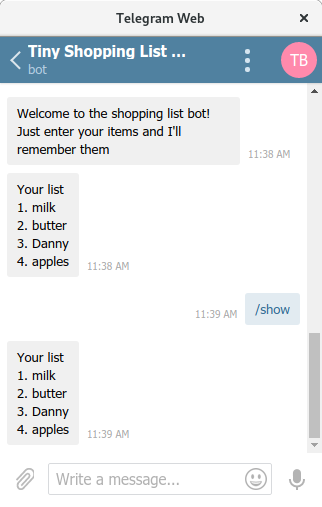

# {YOUR BOT NAME HERE}
{ONE LINE BOT DESCRIPTION HERE} <https://t.me/{BOT_ID}>

* {Participant 1 Name}
* {Participant 2 Name}
* {Participant 3 Name}

{OPTIONAL: MORE PROJECT INFO}

## Screenshots

## How to Run This Bot

### Prerequisites
* Python 3.7
* pipenv
* MongoDB
* {ADD MORE DEPENDENCIES HERE}

### Setup
* Clone this repo from github
* Install dependencies: `pipenv install`
* Get a BOT ID from the [botfather](https://telegram.me/BotFather).
* Create a `secret_settings.py` file:

        BOT_TOKEN = "your-bot-token-here"

### Run
To run the bot use:

    pipenv run python bot.py

(Or just `python bot.py` if running in a pipenv shell.)

## Credits and References
* [Telegram Docs](https://core.telegram.org/bots)
* [python-telegram-bot](https://github.com/python-telegram-bot/python-telegram-bot)
* {ADD MORE REFERENCES HERE}

